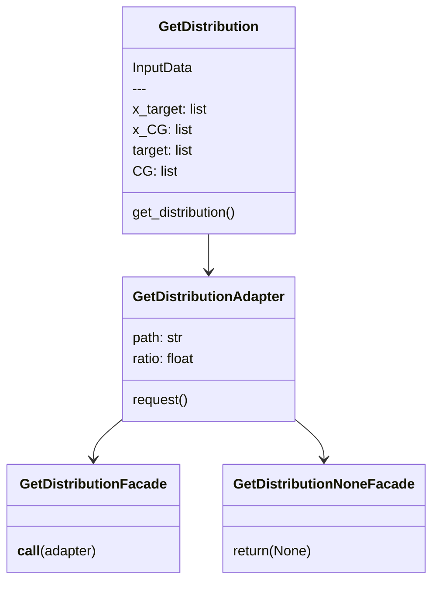
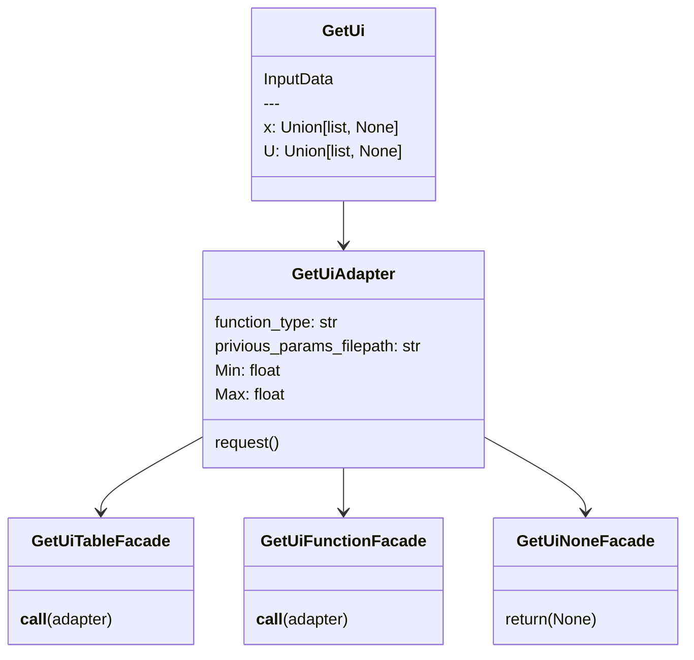
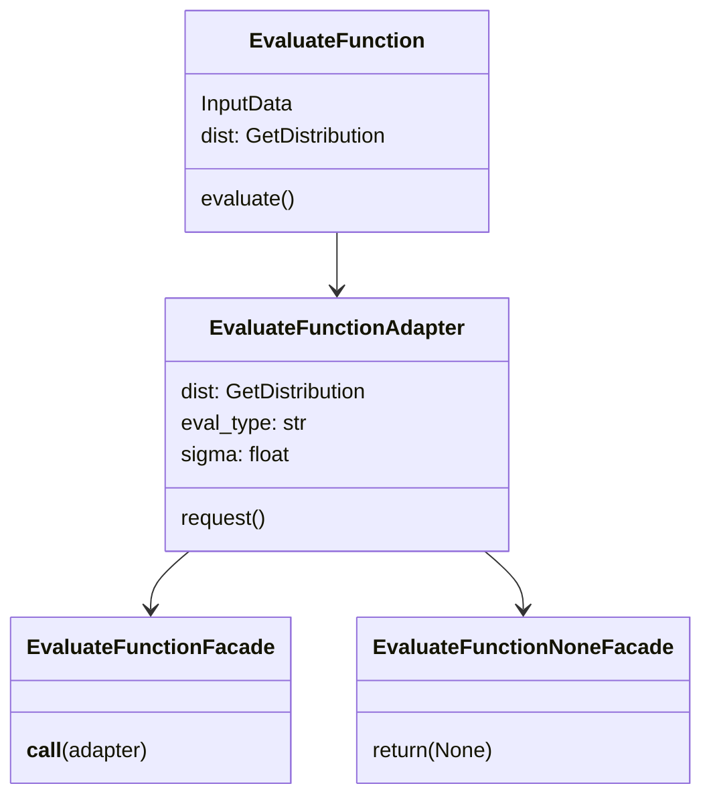
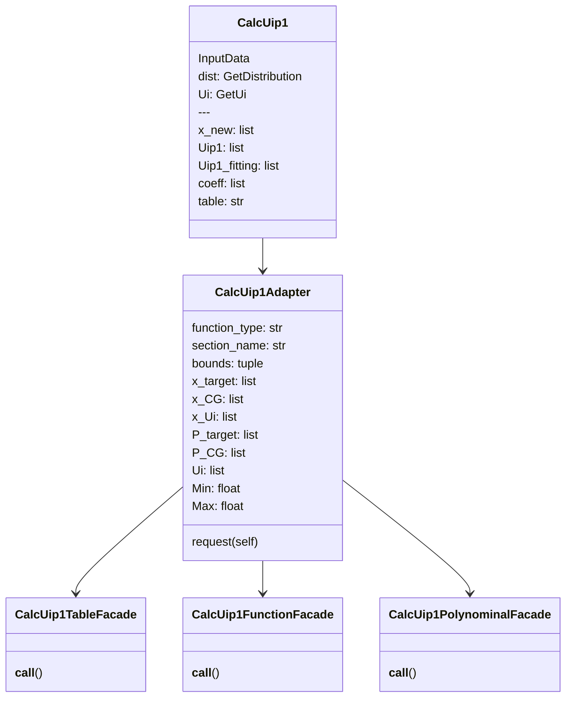

# research/IBI program

## IBI program
* Program to **calculate the potential of ${\rm step}\ i+1$** from the distribution P of ${\rm step}\ i$.
* **BI** as well as **IBI** are possible.
* $P_i$ and $P_{\rm target}$ **agreement** can also be evaluated.

### How to use
- Preparations
    1. input.yaml
    2. *histogram table* of CG (already normalized)
    3. *histogram table* of target (already normalized)
    4. (only IBI) potential parameters (`previous_params_filepath`) or table of ${\rm step}\ i$

    \<example of *histogram table*\>
    ```
    theta    hist
    0        0.000
    1.0      0.000
    2.0      0.001
    ```
    - 2 columns (The 3rd row and beyond won't be read)
    - Header must be **one** line
    - delimiter: **tab**
    - column 0: x-axis (such as $l$, )
    - column 1: y-axis (in other words "histogram value")

- Run
    ```bash
    python main.py -in input.yaml
    ```

- Output file
    1. LAMMPS potential table `*.table`
    2. potential coefficients `*.param`
    3. png comparing ($U_i$, )$U_{i+1}$, $U_{i+1}{\rm -fitting}$

### about: input file "input.yaml"
```yaml=
"AA":
  "type": "bond" # "bond", "angle", "dihed", and so on. This is free word.
  "function_type": "harmonic_bond" # see below
  "eval_type": "bonded" # "bonded" or "non_bonded"
  "eval_sigma": 1 # use for "non_bonded eval_func"
  "P_target_path": "target/tar_bond-AA.dat"
  "P_CG_path": "step_i/CG_bond-AA.dat"
  "previous_params_filepath": "step_i/bond-AA.param"
  "min": 2 # minimum of xaxis of plot and LAMMPS potential table
  "max": 5 # maxima of xaxis of plot and LAMMPS potential table
  "ratio": 0.01 # Distirution values lower than "ratio" are truncated.
  "bounds": # see scipy.optimize.curve_fit
    - [0, 10]
    - [2, 30]
  "output_dir": "step_ip1" # All output files are stored here.

"AB":
  ...
```


### about: `function_type`
- table
- [harmonic_bond](https://docs.lammps.org/bond_harmonic.html)
    $$
    U_{\rm bond}=K(l-l_0)^2
    $$
- [harmonic_angle](https://docs.lammps.org/angle_harmonic.html)
    $$
    U_{\rm angle}=K(\theta-\theta_0)^2\ (K\ {\rm [energy]},\ \theta\ [{\rm degree}])
    $$
- [gaussian](https://docs.lammps.org/angle_gaussian.html)
    $$
    U=-k_{\rm B}T\ln{\left[
    \sum_{i=1}^2{\frac{a_i}{w_i\sqrt{\pi/2}}\exp{
    \left\{
    -2\left(\frac{\theta-\theta_i}{w_i}\right)
    \right\}
    }}
    \right]}\ (\theta\ {\rm [degree]})
    $$
- [nharmonic5](https://docs.lammps.org/dihedral_nharmonic.html)
    $$
    U=
    $$
- [nharmonic7](https://docs.lammps.org/dihedral_nharmonic.html)
- pair_polynominal

---

### about: `P_target_path`, `P_CG_path`
As explained in Section "How to use/preparation".
- `P_target_path`: required
- `P_CG_path`: arbitrary, if not, BI

---

### about: `eval_type`, `eval_sigma`
for bonded evaluate function (`eval_sigma` is $\sigma$ below)
$$
f_{\rm non-bond}=\int_r \exp{(-r/\sigma)}\left(P_{\rm target}(r)-P_{\rm CG}(r)\right)^2{\rm d}r
$$

for non-bonded evaluate function

$$
f_{\rm bond}=\int_x \left(P_{\rm target}(x)-P_{\rm CG}(x)\right)^2{\rm d}x
$$

---

### about: `previous_params_file`

ex1. `function_type` = `harmonic_bond`

```
50.23852 4.5
```
- half-width space delimiter
- only one row
- Forms that can be copied and pasted directly into `*_coeff` in LAMMPS

ex2. `function_type` = `gaussian`

```
0.05599700755882821 0.2602738180935012 109.00000000000001 1.1494204534595935 0.5273574788996689 197.00000000001282
```

ex3. `function_type` = `table`

```
step_n/bond-AA.table bond-AA
```
- half-width space delimiter
- `(table path) (senction name)`
- only one row
- Forms that can be copied and pasted directly into `*_coeff` in LAMMPS


---

### about: `ratio`
Values near 0 in the histogram (near the bottom) are truncated because they become noise when fitting with the function.\
This program truncates values less than **(ratio) × (the maximum value of the histogram)**.

default: 0.01


---
---
---

(technical specification)

### use case
- evaluate function
- BI (IBI step 0)
    - Using only P_target, then Boltzmann Inversion
    - with/without funciton (such as harmonic, gaussian, ...)
- IBI with function (arbitrary)
    - harmonic
    - gaussian
    - nharmonic5 and 7
    - polynominal
- IBI without function (LAMMPS table shape)
    - [table format](https://docs.lammps.org/pair_table.html)

### domain model

#### main
```python=
# get P_target, P_CG
dist = GetDistribution(InputData).get_distribution()

# get_Ui
Ui = GetUi(InputData).get_Ui()

# evaluation function
evaluater = EvaluateFunction(InputData, dist).evaluate()

# IBI
Uip1 = CalcUip1(InputData, dist, Ui).calc_Uip1()

# save potential coefficients and table
# plot U_i, U_(i+1), U_(i+1)-fitting
```
---
#### Get Distribution Service


#### Get Ui Service


#### Evaluate Function Service
$$
f_{\rm non-bond}=\int_r \exp{(-r/\sigma)}\left(P_{\rm target}(r)-P_{\rm CG}(r)\right)^2{\rm d}r
$$

$$
f_{\rm bond}=\int_x \left(P_{\rm target}(x)-P_{\rm CG}(x)\right)^2{\rm d}x
$$



#### Calc Uip1 Service (IBI)
$$
U_{i+1}=U_i+k_{\rm B}T\ln{\frac{P_i}{P_{\rm target}}}
$$


### directory structures
```
<domain>
　├input.yaml
　├main.py
　├<module>
　│　├<adapter>
　│　│　├calc_Uip1_adapter.py
　│　│　├evaluate_function_adapter.py
　│　│　├get_distribution_adapter.py
　│　│　└get_Ui_adapter.py
　│　├<common>
　│　│　└LAMMPS_potential_table_IO.py
　│　├<contents>
　│　│　├evaluate_functions.py
　│　│　├<functions>
　│　│　│　├evaluate_functions.py
　│　│　│　├gaussian.py
　│　│　│　├harmonic.py
　│　│　│　├nharmonic5.py
　│　│　│　├nharmonic7.py
　│　│　│　└pair_polynominal.py
　│　│　├parameters.py
　│　│　└potential_functions.py
　│　├<facade>
　│　│　├calc_Uip1_function_facade.py
　│　│　├calc_Uip1_polynominal_facade.py
　│　│　├calc_Uip1_table_facade.py
　│　│　├evaluate_function_facade.py
　│　│　├evaluate_function_none_facade.py
　│　│　├get_distribution_facade.py
　│　│　├get_distribution_none_facade.py
　│　│　├get_Ui_function_facade.py
　│　│　├get_Ui_none_facade.py
　│　│　└get_Ui_table_facade.py
　│　└<service>
　│　　　├calc_Uip1_service.py
　│　　　├evaluate_function_service.py
　│　　　├get_distribution_service.py
　│　　　└get_Ui_service.py
　├setup.cfg
　├<step_i>
　│　├angle_1.param
　│　├angle_2.param
　│　├bond_1.param
　│　├bond_2.param
　│　├CG-Angle_1.hist.dat
　│　├CG-Angle_2.hist.dat
　│　├CG-Bond_1.hist.dat
　│　├CG-Bond_2.hist.dat
　│　├CG-Dihedral_1.hist.dat
　│　├CG-Dihedral_2.hist.dat
　│　├dihed_1.param
　│　├dihed_2.param
　│　├pair-AA-11.param
　│　├pair-AA-11.param_
　│　├pair-AB-11.param
　│　├pair-AB-11.param_
　│　├pair-BB-11.param
　│　├pair-BB-11.param_
　│　├rdf.AA
　│　├rdf.AB
　│　└rdf.BB
　├<step_ip1>
　│　├AA.table
　│　├ABA.table
　│　├angle-ABA.param
　│　├angle-ABA.png
　│　├angle-BAB.png
　│　├angle_1.param
　│　├angle_2.param
　│　├BAB.table
　│　├bond-AA.png
　│　├bond_1.param
　│　├pair-AA-11.param_
　│　├pair-AA.table
　│　├pair-pair-AA.param
　│　└pair-pair-AA.png
　└<target_distribution>
　　　├angle_1.dat
　　　├angle_2.dat
　　　├bond_1.dat
　　　├bond_2.dat
　　　├dihed_1.dat
　　　├dihed_2.dat
　　　├rdf.AA
　　　├rdf.AB
　　　└rdf.BB
```