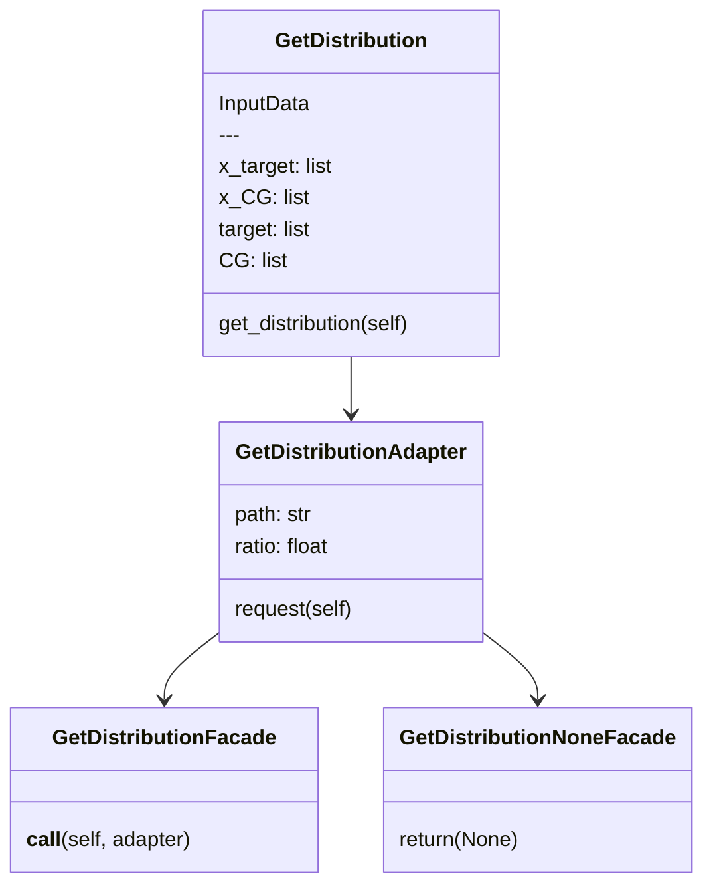
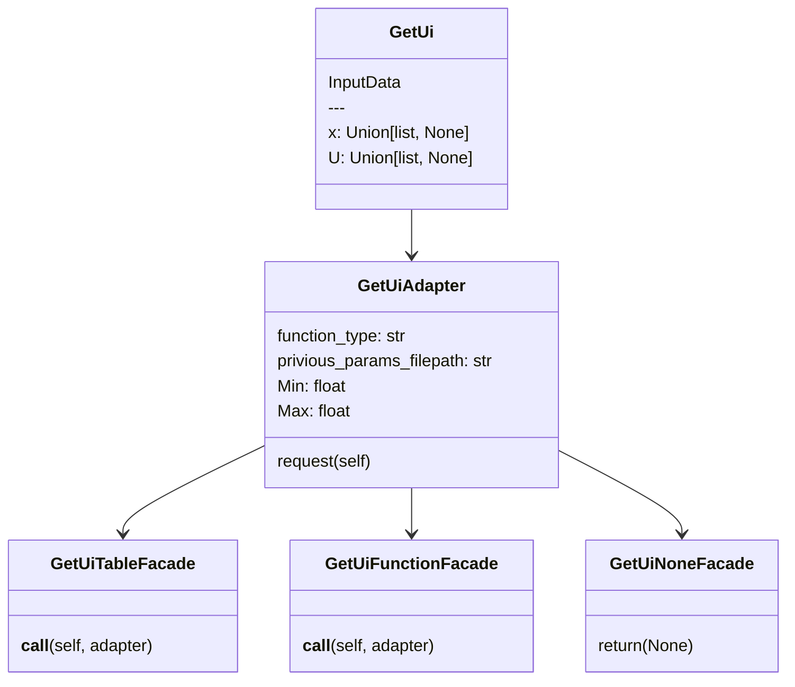
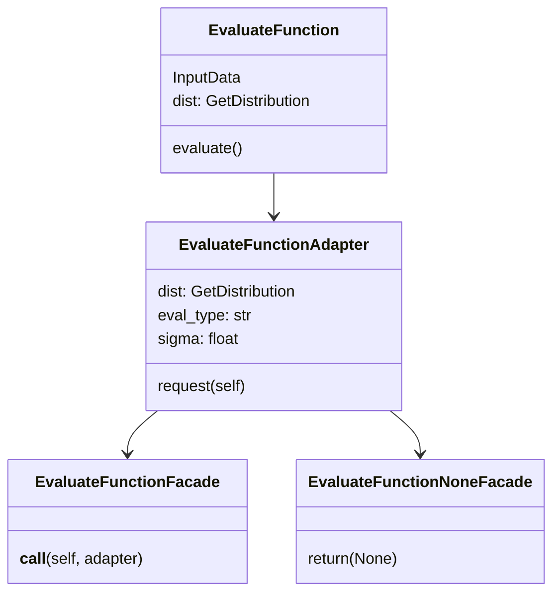
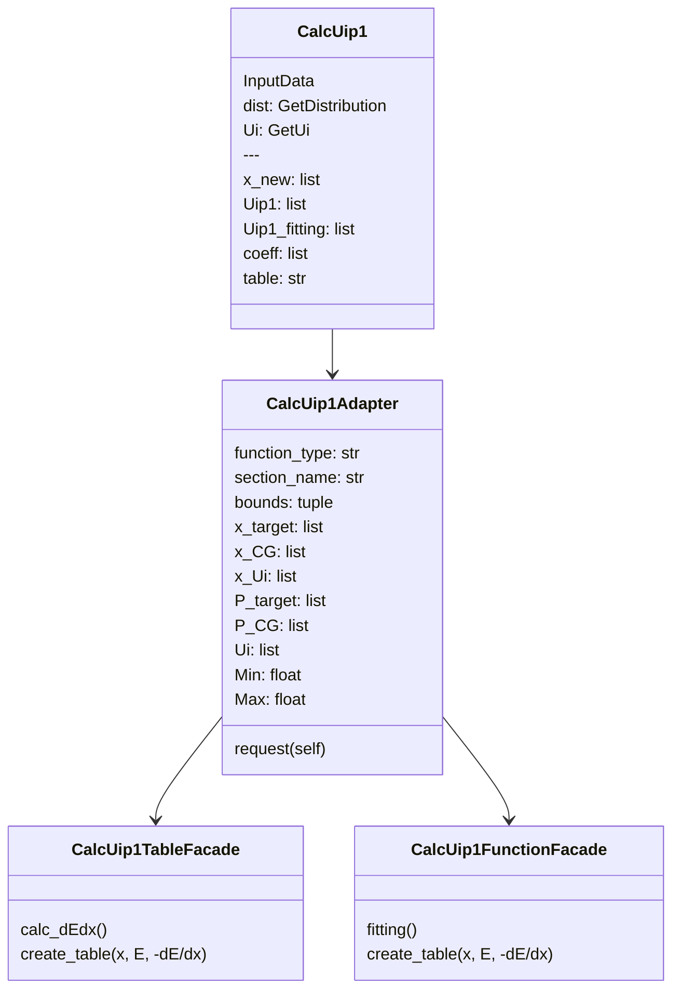

# research/IBI program

## IBI program
Program to **calculate the potential of step_i+1** from the distribution P of step_i.\
**BI** as well as **IBI** are possible.\
P_i and P_target **agreement** can also be evaluated.

### How to use
- Preparations
    1. input.yaml
    2. *histogram table* of CG (already normalized)
    3. *histogram table* of target (already normalized)
    4. (only IBI) potential parameters or table of ${\rm step}\ i$

    \<example of *histogram table*\>
    ```
    theta    hist
    0        0.000
    1.0      0.000
    2.0      0.001
    ```
    - 2 columns (The 3rd row and beyond won't be read)
    - Header must be **one** line
    - delimiter: **tab**
    - column 0: x-axis (such as $l$, )
    - column 1: y-axis (in other words "histogram value")

- Run
    ```bash
    python main.py -in input.yaml
    ```

### about: input file "input.yaml"
```yaml=
"AA":
  "type": "bond" # "bond", "angle", "dihed", and so on. This is free word.
  "function_type": "harmonic_bond" # see below
  "eval_type": "bonded" # "bonded" or "non_bonded"
  "eval_sigma": 1 # use for "non_bonded eval_func"
  "P_target_path": "target/tar_bond-AA.dat"
  "P_CG_path": "step_i/CG_bond-AA.dat"
  "previous_params_filepath": "step_i/bond-AA.param"
  "min": 2 # minimum of xaxis of plot
  "max": 5 # maxima of xaxis of plot
  "ratio": 0.01 # Distirution values lower than "ratio" are truncated.
  "bounds": # see scipy.optimize.curve_fit
    - [0, 10]
    - [2, 30]
  "output_dir": "step_ip1" # All output files are stored here.

"AB":
  ...
```

### about: previous_params_file

1. function potential
    ```
    50.23852 4.5
    ```
- half-width space delimiter
- only one row
- Forms that can be copied and pasted directly into `*_coeff` in LAMMPS

2. table potential
    ```
    step_n/bond-AA.table bond-AA
    ```
- half-width space delimiter
- `(table path) (senction name)`
- only one row
- Forms that can be copied and pasted directly into `*_coeff` in LAMMPS

---

### about: potential function types
- common
    - table
- bond
    - [harmonic_bond](https://docs.lammps.org/bond_harmonic.html)

- angle
    - [harmonic_angle](https://docs.lammps.org/angle_harmonic.html)
    - [gaussian](https://docs.lammps.org/angle_gaussian.html)
- dihedral
    - [nharmonic5](https://docs.lammps.org/dihedral_nharmonic.html)
    - [nharmonic7](https://docs.lammps.org/dihedral_nharmonic.html)
- pair
    - polynominal (coming soon)

---

### about: ratio
Values near 0 in the histogram (near the bottom) are truncated because they become noise when fitting with the function.\
This program truncates values less than (ratio) × (the maximum value of the histogram).

---
---
---

(technical specification)

### use case
- BI (IBI step 0)
    - Using only P_target, then Boltzmann Inversion
    - with/without funciton (such as harmonic, gaussian, ...)
- IBI with function (arbitrary)
    - harmonic
    - gaussian
    - nharmonic5 and 7
    - polynominal
- IBI without function (LAMMPS table shape)
    - [table format](https://docs.lammps.org/pair_table.html)

### calculation flow
- BI with function
    1. receive P_target and processing
    2. BI
    3. fitting to function
    4. plot and output (parameters)

- BI without function
    1. receive P_target and processing
    2. BI
    3. calculate -dE/dr
    4. plot and output (table file, its path, section_name)

- IBI with function (IBI step i to i+1)
    1. receive P_target, P_CG and processing
    2. receive functional type, [parameters(i)], and x(list) same as 1.
    3. IBI
    4. fitting to function
    5. plot and output (parameters)

- IBI without function (IBI step i to i+1)
    1. receive P_target, P_CG and processing
    2. receive (functional type)="table", parameters(i)=[table path, section_name].
    3. IBI
    4. calculate -dE/dr
    5. plot and output (parameters)

### directory structures
```
.----- step_i
  |
  ---- step_ip1
  |
  ---- module
  |
  main.py
  input.yaml
```

### domain model

#### main
```python=
# get P_target, P_CG
dist = GetDistribution(InputData)
dist.get_distribution()

# get_Ui
Ui = GetUi(InputData)
Ui.get_Ui()

# evaluation function
# <not yet installed>

# IBI
Uip1 = CalcUip1(InputData, dist, Ui)
Uip1.calc_Uip1()

# save potential coefficients and table
# plot U_i, U_(i+1), U_(i+1)-fitting
```
---
#### Get Distribution Service


#### Get Ui Service


#### Evaluate Function Service
$$
f_{\rm non-bond}=\int_r \exp{(-r/\sigma)}\left(P_{\rm target}(r)-P_{\rm CG}(r)\right)^2{\rm d}r \\
f_{\rm bond}=\int_x \left(P_{\rm target}(x)-P_{\rm CG}(x)\right)^2{\rm d}x
$$


#### Calc Uip1 Service (IBI)
$$
U_{i+1}=U_i+k_{\rm B}T\ln{\frac{P_i}{P_{\rm target}}}
$$
